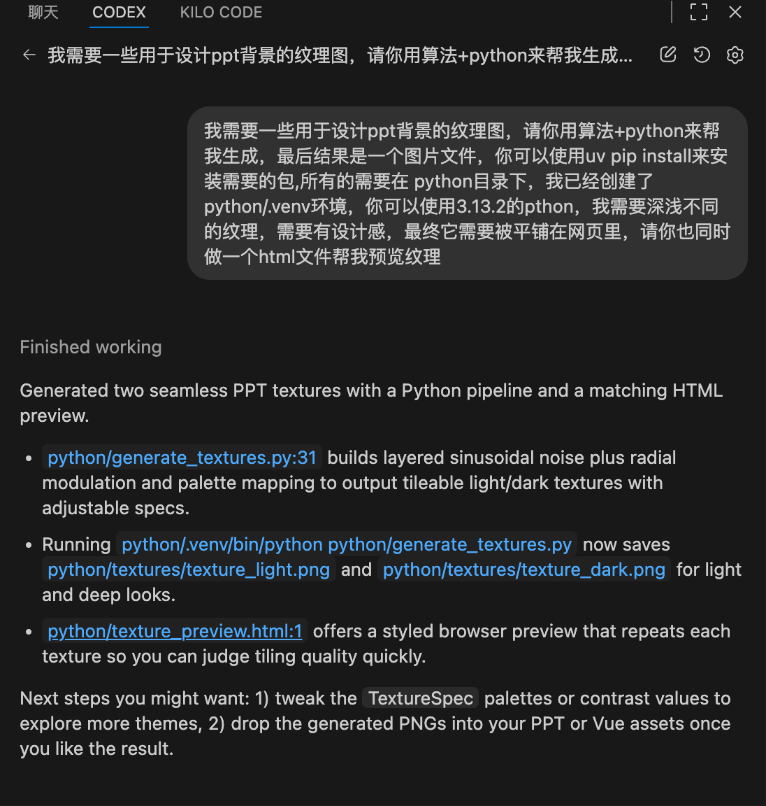

# 这个目录是干什么的
这个目录是用来给大模型生成Python代码来创造一些用于ppt的组件。
比如说，我让codex写python脚本生成了一些ppt的纹理。
可以发挥想象，用代码来创造任何。

## 示例指令
> 我需要一些用于设计ppt背景的纹理图，请你用算法+python来帮我生成，最后结果是一个图片文件，你可以使用uv pip install来安装需要的包,所有的需要在 python目录下，我已经创建了python/.venv环境。
> 我需要深浅不同的纹理，需要有设计感，最终它需要被平铺在网页里，请你也同时做一个html文件帮我预览纹理

## 准备 Python 环境
1. 确保已经安装 [uv](https://github.com/astral-sh/uv)，然后在仓库根目录执行：
   ```bash
   uv pip install --python python/.venv/bin/python pillow numpy
   ```
   这会在已经配置好的 `python/.venv`（Python 3.13.2）环境里安装所需依赖。

## 生成纹理
1. 使用项目自带虚拟环境运行生成脚本：
   ```bash
   python/.venv/bin/python python/generate_textures.py
   ```
2. 运行完成后会在 `python/textures/` 目录下生成 `texture_light.png` 和 `texture_dark.png` 两张可平铺纹理。

## 预览纹理 HTML
1. 通过系统的 `open` 命令在浏览器中打开预览页面：
   ```bash
   open python/texture_preview.html
   ```
2. 页面会展示浅色与深色两种纹理的平铺效果，方便挑选或对比。

## demo


